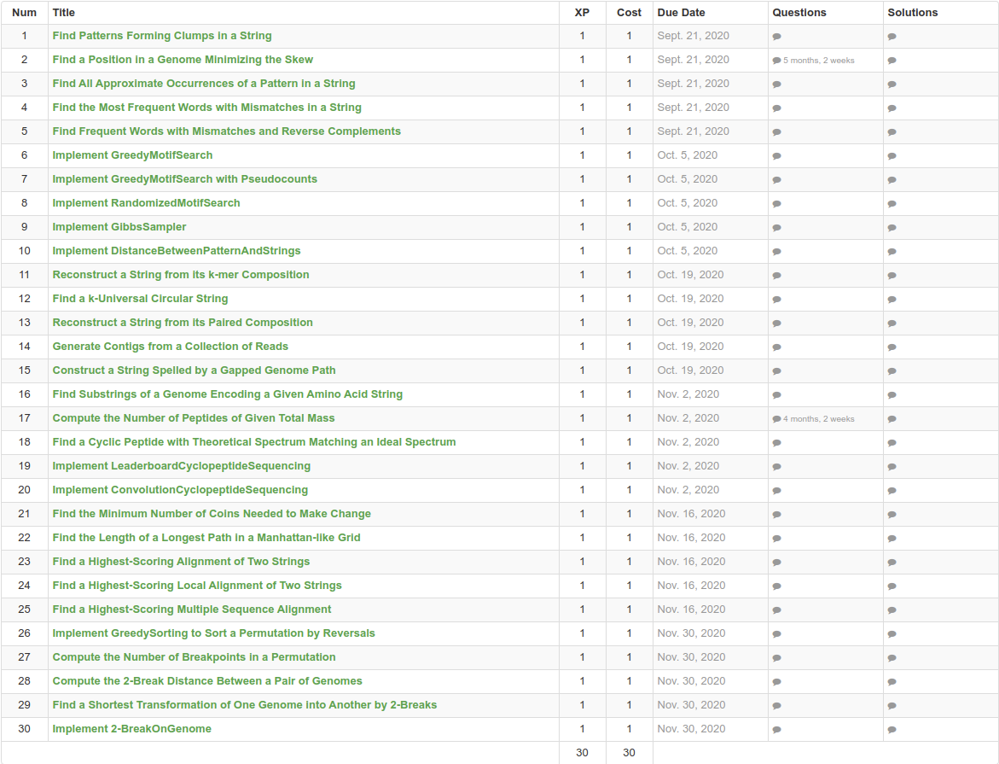

# Bioinformatics Algorithms (FIVT_Bioinfo) 2020

#### [Course link](http://rosalind.info/classes/752/)

### Details:

Fall 2020

Thursday, time TBA

Instructor: Baulin E.F., Algorithms and Technologies of Programming Chair

The course is based on MOOC «Bioinformatics Algorithms, An Active Learning Approach».

### Authors:

Pavel Pevzner (University of California, San Diego)

Phillip E. C. Compeau (University of California, San Diego)

### Resources:

• bioinformaticsalgorithms.org – Lecture Videos and Textbook

• Rosalind.info – Programming Exercises

• vk.com/fivt_bioinfo – Discussion and Announcements

### Topics:

1) Where Does DNA Replication Begin? (Algorithmic Warm-up)

2) Which DNA Patterns Act As Cellular Clocks? (Greedy and Randomized Algorithms)

3) How Do We Assemble Genomes? (Graph Algorithms)

4) How Do We Sequence Antibiotics? (Brute Force Algorithms)

5) How Do We Compare Biological Sequences? (Dynamic Programming Algorithms)

6) Are There Fragile Regions in the Human Genome? (Combinatorial Algorithms)

### Results:

